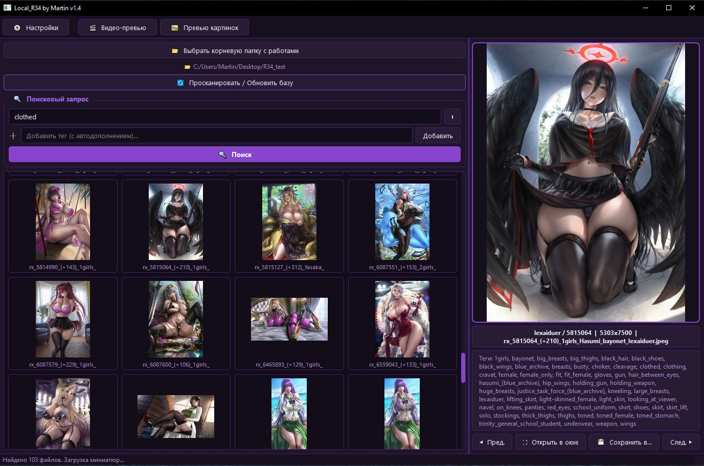

<div align="center">

# 🗂️ Local R34 by Martin
### v1.6 — Local viewer & tag search for Rule34 content

[](https://python.org)
[](https://doc.qt.io/qtforpython/)
[](https://github.com/trickerer01/Ruxx)
[](https://www.donationalerts.com/r/cheburnet_club)

</div>



---

> 🇷🇺 [Русское описание ниже](#-описание)  
> 🇬🇧 [English description below](#-description)

---

## 🇷🇺 Описание

**Local R34** — это десктопная программа для удобного **локального поиска и просмотра** изображений и видео, скачанных с сайта Rule34 с помощью утилиты [Ruxx](https://github.com/trickerer01/Ruxx).

Если у тебя на диске лежат сотни гигабайт арта, и ты устал бесконечно листать папки в проводнике — эта прога для тебя.  
Она строит базу тегов из JSON-файлов Ruxx, после чего **поиск по любому тегу занимает доли секунды**.

---

### ✨ Возможности

| Функция | Описание |
|---|---|
| 🔍 Поиск по тегам | Мгновенный поиск по одному или нескольким тегам с автодополнением |
| 🖼️ Превью изображений | Автоматическая генерация и кеширование миниатюр |
| 🎬 Живые превью видео | Нарезка кадров из видео — листаются прямо в сетке, как на сайте |
| 📥 Загрузчик (Ruxx) | Встроенный интерфейс для массового скачивания по тегам через Ruxx |
| 🎨 9 тем оформления | Тёмные и пастельные темы с цветными акцентами |
| 🌐 Два языка | Интерфейс на русском и английском |
| 💾 Быстрое копирование | Сохрани нужный файл в любую папку одной кнопкой |
| ⚡ Быстрее проводника | Поиск по 100 000+ файлов быстрее, чем Windows Explorer |

---

### 🖥️ Главное окно

```
┌──────────────────────────────┬────────────────────────────────┐
│  📁 Папка авторов            │                                │
│  🔄 Сканировать базу         │    [ Просмотр файла ]          │
│                              │                                │
│  ┌─────────────────────────┐ │  👤 Автор   🔢 ID   📄 PNG   │
│  │ 🔍 Поисковый запрос     │ │  📦 Размер файла               │
│  │ тег1 тег2 тег3          │ │                                │
│  │ [+ Добавить тег]        │ │  [ Теги файла... ]             │
│  │ [🔍 Поиск]              │ │                                │
│  └─────────────────────────┘ │  ◀ Пред.  ⛶ Окно  💾  След. ▶│
│                              │                                │
│  [ Сетка миниатюр ]          │                                │
└──────────────────────────────┴────────────────────────────────┘
```

**Левая панель:**
- Выбор корневой папки с работами (структура: `корень/автор/файлы`)
- Кнопка сканирования — строит или обновляет базу тегов
- Поле поиска с автодополнением по тегам
- Сетка миниатюр с результатами поиска

**Правая панель:**
- Просмотр выбранного изображения или живое превью видео (листание кадров)
- Метаданные файла: автор, ID (`rx_XXXXXXXXX`), формат, размер
- Список всех тегов файла (можно выделить мышью)
- Навигация по результатам, открытие в отдельном окне, сохранение копии

**Тулбар:**
- `⚙ Настройки` — выбор темы и языка
- `🎬 Видео-превью` — заранее нарезать кадры для всех видео в базе
- `🖼️ Превью картинок` — заранее сгенерировать все миниатюры
- `📥 Скачать из R34` — открыть окно загрузчика

---

### 📥 Окно загрузки (Ruxx)

Встроенный интерфейс для утилиты [Ruxx](https://github.com/trickerer01/Ruxx) позволяет скачивать контент прямо из программы:

- **Список тегов** — каждый тег с новой строки; для каждого создаётся отдельная папка
- **Путь к Ruxx.exe** — с кнопкой «Обзор» для выбора файла
- **Папка сохранения** — с кнопкой «Обзор» для выбора папки
- **API ключ** — необязательно; формат: `api_key.user_id` (через точку)
- **Прогресс-бар** — показывает `Имя_тега [12 из 80 тегов]`
- **Лог** — история всех обработанных тегов
- Кнопки корректной и принудительной остановки

> ℹ️ Ruxx — отдельная утилита. Скачай её здесь: [github.com/trickerer01/Ruxx](https://github.com/trickerer01/Ruxx)  
> Положи `Ruxx.exe` рядом с `Local_R34.exe` — программа найдёт его автоматически.

---

### 🚀 Быстрый старт

```
1. Скачай и распакуй архив программы
2. Запусти Local_R34.exe
3. Выбери корневую папку с работами
4. Нажми "Просканировать / Обновить базу"
5. Нажми "Превью картинок" и "Видео-превью" (один раз, для кеша)
6. Ищи по тегам!
```

**Структура папки с работами:**
```
корневая_папка/
  ├── author_name_1/
  │     ├── rx_123456789.jpg
  │     ├── rx_123456789.json  ← теги и метаданные от Ruxx
  │     └── ...
  └── author_name_2/
        └── ...
```

---

### 💸 Поддержать проект

Если программа тебе нравится — можно задонатить:  
**[donationalerts.com/r/cheburnet_club](https://www.donationalerts.com/r/cheburnet_club)**

*With love from Martin Ramzires ❤️  
Special for CHEBURNET CLUB 2026*

---
---

## 🇬🇧 Description

**Local R34** is a desktop application for fast **local search and browsing** of images and videos downloaded from Rule34 using the [Ruxx](https://github.com/trickerer01/Ruxx) utility.

If you have hundreds of gigabytes of art on your drive and you're tired of scrolling through folders in Explorer — this app is for you.  
It builds a tag database from Ruxx JSON files, and **searching by any tag takes milliseconds**.

---

### ✨ Features

| Feature | Description |
|---|---|
| 🔍 Tag search | Instant search by one or multiple tags with autocomplete |
| 🖼️ Image previews | Automatic thumbnail generation and caching |
| 🎬 Live video previews | Frame extraction from videos — animated in the grid, like on the site |
| 📥 Downloader (Ruxx) | Built-in UI for bulk downloading by tags via Ruxx |
| 🎨 9 UI themes | Dark and pastel themes with colored accents |
| 🌐 Two languages | Russian and English interface |
| 💾 Quick copy | Save any file to any folder with one click |
| ⚡ Faster than Explorer | Search across 100,000+ files faster than Windows Explorer |

---

### 🖥️ Main Window

```
┌──────────────────────────────┬────────────────────────────────┐
│  📁 Authors folder           │                                │
│  🔄 Scan database            │    [ File Viewer ]             │
│                              │                                │
│  ┌─────────────────────────┐ │  👤 Author  🔢 ID  📄 PNG     │
│  │ 🔍 Search Query         │ │  📦 File size                  │
│  │ tag1 tag2 tag3          │ │                                │
│  │ [+ Add tag]             │ │  [ File tags... ]              │
│  │ [🔍 Search]             │ │                                │
│  └─────────────────────────┘ │  ◀ Prev  ⛶ Window  💾  Next ▶ │
│                              │                                │
│  [ Thumbnail Grid ]          │                                │
└──────────────────────────────┴────────────────────────────────┘
```

**Left panel:**
- Root folder selection (structure: `root/author/files`)
- Scan button — builds or updates the tag database
- Search field with tag autocomplete
- Thumbnail grid with search results

**Right panel:**
- View selected image or live video preview (animated frames)
- File metadata: author, ID (`rx_XXXXXXXXX`), format, file size
- Full list of file tags (selectable with mouse)
- Navigation through results, open in separate window, save a copy

**Toolbar:**
- `⚙ Settings` — theme and language selection
- `🎬 Video Preview` — pre-generate frames for all videos in the database
- `🖼️ Image Preview` — pre-generate all thumbnails
- `📥 Download from R34` — open the downloader window

---

### 📥 Download Window (Ruxx)

The built-in interface for [Ruxx](https://github.com/trickerer01/Ruxx) lets you download content directly from the app:

- **Tag list** — one tag per line; a separate folder is created for each tag
- **Path to Ruxx.exe** — with a Browse button
- **Output folder** — with a Browse button
- **API key** — optional; format: `api_key.user_id` (dot-separated)
- **Progress bar** — shows `tag_name [12 of 80 tags]`
- **Log** — history of all processed tags
- Soft and hard stop buttons

> ℹ️ Ruxx is a separate tool. Download it here: [github.com/trickerer01/Ruxx](https://github.com/trickerer01/Ruxx)  
> Place `Ruxx.exe` next to `Local_R34.exe` — the app will find it automatically.

---

### 🚀 Quick Start

```
1. Download and unpack the archive
2. Run Local_R34.exe
3. Select the root folder with your works
4. Click "Scan / Update Database"
5. Click "Image Preview" and "Video Preview" (once, to build the cache)
6. Search by tags!
```

**Folder structure:**
```
root_folder/
  ├── author_name_1/
  │     ├── rx_123456789.jpg
  │     ├── rx_123456789.json  ← tags and metadata from Ruxx
  │     └── ...
  └── author_name_2/
        └── ...
```

---

### 💸 Support the project

If you enjoy the app, consider donating:  
**[donationalerts.com/r/cheburnet_club](https://www.donationalerts.com/r/cheburnet_club)**

*With love from Martin Ramzires ❤️  
Special for CHEBURNET CLUB 2026*
